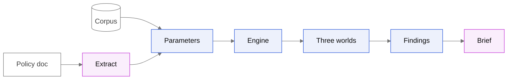
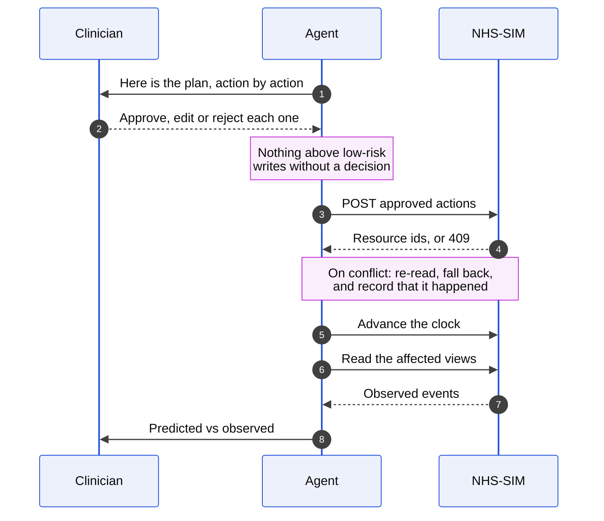

<p align="center">
  <picture>
    <source media="(prefers-color-scheme: dark)" srcset="docs/assets/atlas-dark.webp">
    
  </picture>
</p>

<h1 align="center">PolicySim</h1>

<p align="center"><strong>Don’t discover policy failure in patients. Simulate it first.</strong></p>

<p align="center">
  
  
  
  
  
</p>

---

## What it does

A planner uploads the policy document they already wrote. It becomes engine parameters, each one
tagged with where it came from. A deterministic simulation of the neighbourhood runs it many times
and reports the **10th, 50th and 90th percentile of the outcome**: three plausible worlds, not
three worst cases stacked together.

You do not get a number. You get which of your conclusions survive all three worlds, and the
condition each one holds under.

Then it closes the loop: the recommendation goes down to a named patient, a clinician approves each
action, the actions are written to the real NHS-SIM world, and predicted is measured against
observed.

## Screens

<!-- Screenshots go here. -->

## How it works



A language model reads the document at one end and writes the summary at the other. It is never
allowed between them, so no model output is ever fed straight into another.

**Three worlds are output percentiles, not input corners.** Setting twelve parameters to their
worst value at once describes a future with almost no chance of occurring, which makes it useless
to plan against. Parameters are sampled from their published ranges and the percentiles are taken
from the *results*.

## Closing the loop

The part that stops this being a toy: the recommendation is applied to the real simulator and
checked.



Proven against the live world: **5 of 6 actions applied**, real resource ids returned, **1 fallback
fired and recorded**, **30 observed events**. The sixth failed on `No service capacity`, which is
the world pushing back rather than the system pretending it did not.

## Run it

```bash
npm install
npm run dev          # interface on :4173, policy API on :4174
npm test             # 238 tests, never touches the network
npm run typecheck
```

Against the live simulator, with `NHSSIM_TEAM_KEY` in `.env`:

```bash
npm run snapshot     # bulk-read the world to snapshot/<ISO>/
npm run calibrate    # snapshot -> engine parameters, with a source tag on each
npm run grid         # precompute the sweep the interface reads
npm run liveloop     # approve a plan, apply it for real, observe what happened
```

## What is real, and what is not

| | |
|---|---|
| Measured from the live world | 14 parameters, including the binding constraint of 4 community visits a day |
| Verified against the live server | All 7 action types, by probing rather than trusting the OpenAPI spec |
| Real apply and verify | Recorded, with the conflict fallbacks that fired |
| Evidence corpus | 30 sources, prioritising anything reporting a range |
| Still synthetic | The interface renders fixtures until the precomputed grid is wired in. Every page says so |
| Not built | Clinician mode's interface. The loop behind it works; the screens do not exist |

## Not modelled, and said out loud

Disease progression, treatment efficacy, adherence, travel, social care. None of them exist in the
simulator being modelled, and the interface states this on screen rather than in a footnote.

## Team

Kaavya (engine, worlds, sensitivity) · Oriol (integration, live loop, interface) · Albert (clinical
model, evidence corpus, policy workbench) · Elsa (interface, delivery)

---

Operational outcomes only. Synthetic patients. A human approves every write.
