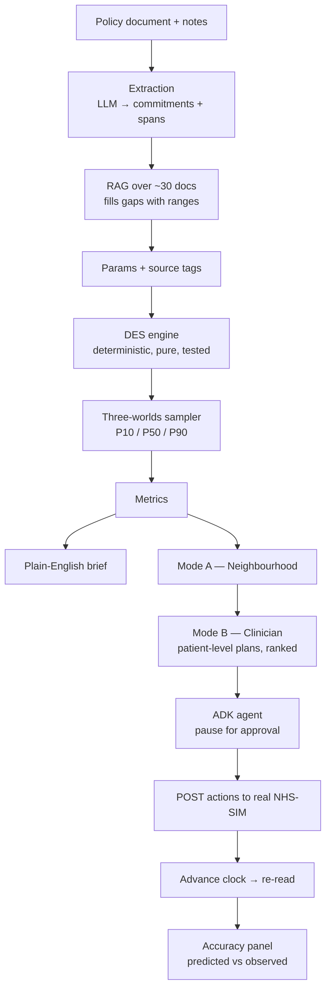

# PolicySim

**Every policy runs in three worlds — optimistic, realistic, pessimistic. See which conclusions survive all three. Then act, with a clinician approving.**

Team 14 · OpenAI × Anima Healthtech Hackathon · 12 Sep 2026

> ⚠️ **This is a template scaffold.** No implementation yet — every file under `src/` is a stub
> with a TODO header naming its owner. Fill in behind the frozen contracts in `src/contracts/`.

---

## What it is

A policymaker drops in a real NHS policy document. An LLM extracts it into engine parameters
(each tagged `measured` / `documented` / `literature` / `assumed`). A deterministic, client-side
discrete-event simulation of the neighbourhood runs it ~1,000 times and reports **P10 / P50 / P90
of the outcome** — three plausible worlds, not three input corners. Conclusions that survive all
three are recommendations; conclusions that only appear in the optimistic world are labelled as such.

Then Clinician mode takes the recommended policy down to a named patient, rehearses three concrete
plans through the same engine, pauses for clinician approval, applies the approved actions to the
real NHS-SIM world, and measures predicted vs observed.

Full spec: **[docs/PRD.md](docs/PRD.md)**.

## Architecture



**Rule:** no LLM output feeds another LLM output without a verifiable, deterministic step in between.

## Repo map

| Path | Owner | Holds |
|---|---|---|
| `src/contracts/` | Kaavya (`Params`, `Metrics`) · Oriol (`Action`) | **Frozen interfaces. Change only by agreement.** |
| `src/engine/` | Kaavya | DES core, nodes, queues, verification assertions |
| `src/worlds/` | Kaavya | Sampler, P10/P50/P90, precomputed grid export |
| `src/analysis/` | Kaavya | Tornado, breakeven, hold-out, accuracy diff |
| `src/integration/` | Oriol | Watcher, snapshot client, calibration extractor |
| `src/agent/` | Oriol | ADK tool wrappers, approval pause, live apply loop |
| `src/extraction/` | Oriol + Albert | Document parse, commitment extraction, RAG |
| `src/clinical/` | Albert | Safe state, auto-vs-approve matrix, red flags, plans |
| `src/ui/` | Elsa | Both modes, screens, components |
| `fixtures/` | everyone | Mock `Params` / `Metrics` / `Action` — **nobody waits for real data** |
| `corpus/` | Albert | ~30 evidence documents + source table |
| `precomputed/` | Kaavya | Grid bundle shipped as JSON — the demo safety net |
| `snapshot/` | Oriol | Raw NHS-SIM JSON, gitignored |
| `demo/` | Elsa | Runbook, fallback clip, stall state |

## Getting started

```bash
npm install
npm run dev
```

(Scripts are placeholders until the toolchain is wired up — see `package.json`.)

## Who owns what

| Person | Owns | Task list |
|---|---|---|
| **Kaavya** | Engine, parameters, verification, three-worlds sampler, sensitivity, hold-out, accuracy diff | [docs/tasks/kaavya.md](docs/tasks/kaavya.md) |
| **Oriol** | Snapshot client, calibration extractor, ADK agent, real apply loop, integration, demo tech | [docs/tasks/oriol.md](docs/tasks/oriol.md) |
| **Albert** | Clinical safety model, patient plans, evidence corpus, parameter sourcing, pitch and narration | [docs/tasks/albert.md](docs/tasks/albert.md) |
| **Elsa** | Interface, README, video capture and edit, submission, stall logistics | [docs/tasks/elsa.md](docs/tasks/elsa.md) |

### Shared docs

| Doc | What it settles |
|---|---|
| [docs/contracts.md](docs/contracts.md) | The three frozen interfaces and the freeze rule |
| [docs/integration-moments.md](docs/integration-moments.md) | The four scheduled handoffs |
| [docs/timeline.md](docs/timeline.md) | Build order and the two hard gates |
| [docs/parameters.md](docs/parameters.md) | Every parameter, its bounds, its source |
| [docs/calibration-findings.md](docs/calibration-findings.md) | What the live sim actually exposes — measured values and caveats |
| [docs/demo-runbook.md](docs/demo-runbook.md) | The three minutes, the never-cut list, the stall |
| [docs/risks.md](docs/risks.md) | What goes wrong and who owns the mitigation |
| [docs/pitch.md](docs/pitch.md) | Pitch and narration |
| [docs/integration-status.md](docs/integration-status.md) | **What the integration track built, how to run it, and what each person needs from it** |
| [docs/nhssim-verified.md](docs/nhssim-verified.md) | What the NHS-SIM server actually accepts, verified by probing it |

## Working agreement

- **Branch per person per feature:** `kaavya/engine-core`, `elsa/three-worlds-view`.
- **Commit early and often.** Repo history proves it was built today.
- **Never break a contract silently.** Change `src/contracts/` only in the group chat, then tell the three people downstream.
- **Nobody waits for real data.** Build against `fixtures/`.

## Disclaimer

Synthetic patients only. Operational outcomes only — no clinical claims. A human approves every
write to the simulated world. The simulator is ground truth; this is a fast, inspectable model of
its rules, verified against it.
